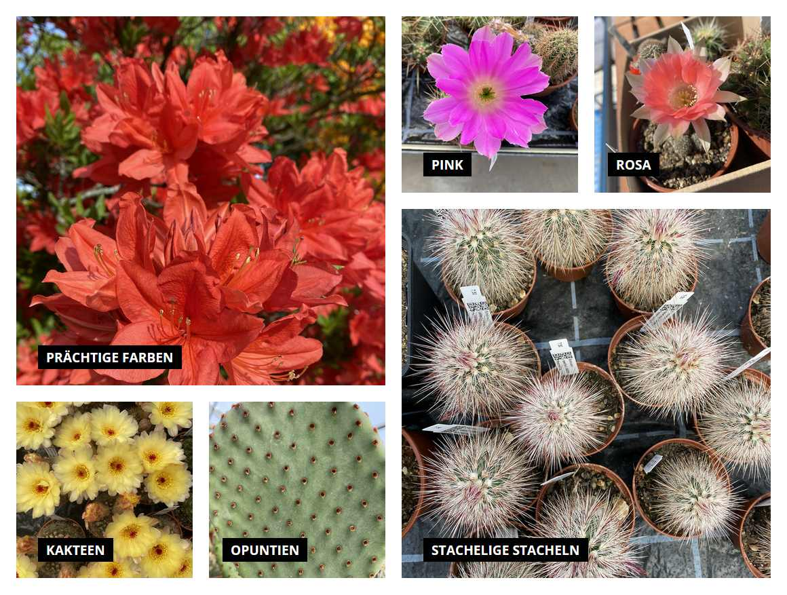

# Shopware5-MyfavSpecialBox
Advanced ImageBox for the shopping-worlds of shopware 5. Shows six images with textOverlays in shoppingWorlds. Design is compatible to the [image-box plugin](https://github.com/sfxon/Shopware5-MyfavImageBox).


And this is what it looks like:



## Installation

1. Extract files to a folder ```custom/plugins/MyfavSpecialBox```

2. Open plugin manager in shopware 5 backend.

3. Install plugin in the plugin manager.

4. Use in a shopping world.